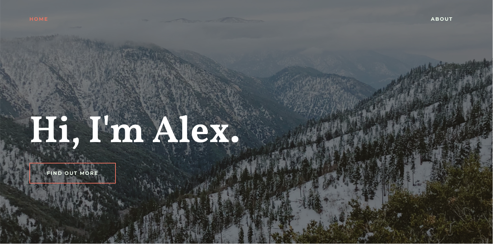

# Personal Site
## Alex Feng

## Description
This is my personal site deployed via Github Pages. The site has 2 functional route pages: a home page and an about page. The site was built with React, Yarn, and Webpack and is hosted on alexfeng.me.
### What Worked
I was able to succesfully host the website using Github pages. This was accomplished by installing github's gh-pages package using yarn. Initially, I ran into issues with deployment on github pages using webpack, but I eventually got it sorted it out (the site is now hosted by the master branch). I was also able to successfully use react routing and implemented the scroll progress indicator using a node package. I also managed to add some animations for the main header on each page. I also successfully implemented horizontal scrolling in the about page for my images.
### What Didn't Work
I wasn't able to use Bootstrap and achieve the level of customization I wanted. For some reason, all my style edits were overridden by Bootstrap, so I decided to cut it from my project. Additionally, I couldn't manage to implement animations upon scrolling onto a component. I attempted to use a node package for this, but the package wasn't behaving as I was expecting it to; it also messed around with style edits and wasn't fading in properly, so I decided to cut this from my project as well.
### Future Additions
In the future, I'm hoping to create more pages (e.g. contact, project demos, etc.). The contact page would likely contain a form submission for privacy reasons, which would require some form of backend server. I also hope to implement mobile compatibility, since the project currently lacks this capability.
### Demo

Above is a demo of the landing page.

Above is a demo of the horizontal scroll and scroll progress indicator (blue bar at top).